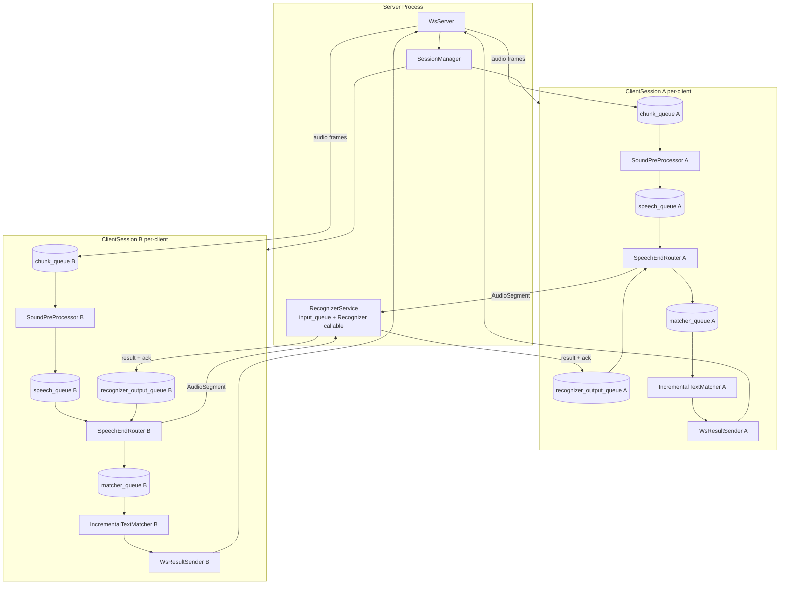

# Plan: Milestone 6.1 — Client-Server Architecture for Voice Agents

## Context

The monolithic STT app runs everything in one process. The goal is to split it into a **server process** (VAD + ASR + text matching + websocket server) and a **client process** (mic capture + GUI + text insertion + voice agent), communicating over WebSocket. From a user perspective the app still launches as one command (`python main.py`) — the server runs in-process and spawns the Tk client as a separate subprocess. A headless `--server-only` mode is supported for MSIX/macOS launcher integration.

The core pipeline components (SoundPreProcessor, Recognizer, IncrementalTextMatcher, etc.) stay unchanged where possible. `SpeechEndRouter` gains a `first_message_id` parameter; `RecognitionResultPublisher` becomes a Protocol; `RecognitionResult` gains `utterance_id`. All other changes are at the boundaries.

---

## Architecture

### Process Model

```
python main.py
  ├── Server runs in THIS process (no GUI)
  │     WsServer (asyncio loop on daemon thread)
  │     RecognizerService (single shared Recognizer thread)
  │     SessionManager (creates ClientSession per WS connection)
  │
  └── Spawns client.py subprocess
        AudioSource → WsClientTransport → RemoteRecognitionPublisher
        → TextFormatter, TextInsertionService
        → ApplicationWindow (tkinter mainloop)
```

`main.py --server-only` runs server without spawning the client subprocess (headless).

`client.py` is the dedicated Tk client entry script — spawned by `main.py`, not intended for direct user invocation. It accepts `--server-url=ws://host:port` so the server can pass the bound port at spawn time.

### Cross-process lifecycle

**Server monitors client subprocess (`main.py` default mode only):**
- After spawning `client.py`, `main.py` starts a daemon watcher thread that calls `client_proc.wait()`.
- When the subprocess exits (any reason: user closed window, crash), the watcher calls `server_app.stop()`.
- `--server-only` mode has no subprocess and no watcher thread — server runs until interrupted.
- On `ServerApp.stop()`, `main.py` also calls `client_proc.terminate()` (idempotent if already exited) to avoid orphaned processes on server-side errors.

**Client detects server disconnect (`WsClientTransport`):**
- If the WebSocket connection drops (server crash, server shutdown, network cut), `WsClientTransport` catches `ConnectionClosed` on its receive loop.
- It logs the error and transitions `ClientApplicationState` → `shutdown`.
- The normal observer chain stops all client components and exits the Tk main loop.
- The client process exits with code 1 (connection lost), which the watcher thread in `main.py` treats as a normal subprocess exit (server is already stopping or already dead).

### Transport

The API specification is in @docs/client-server-api-spec.md

### Async/Sync Boundary Strategy

The existing pipeline is 100% threaded. `websockets` is asyncio-based. One dedicated asyncio event loop thread per server. Two bridge directions:

- **Async → Sync** (WS receive → chunk_queue): `WsAudioReceiver` async coroutine calls `queue.Queue.put_nowait()` directly — safe because `queue.Queue` is thread-safe.
- **Sync → Async** (publisher callback → WS send): `WsResultSender` uses a bounded `asyncio.Queue` (capacity = 20) as an internal send buffer. A single async sender task drains it. The sync `publish_partial_update`/`publish_finalization` calls use `loop.call_soon_threadsafe(queue.put_nowait, encoded)`. If the queue is full, the item is dropped and logged (backpressure). This prevents unbounded task accumulation under fast partial updates.

No `asyncio.Queue` crosses thread boundaries.

---

## New Module Structure

```
src/
  network/
    types.py          # WsAudioFrame, WsShutdownCommand, WsRecognitionResult, WsSessionCreated, WsSessionClosed, WsError
    codec.py          # encode_audio_frame(), decode_audio_frame(), encode_server_message(), decode_client_message()
  ServerApplicationState.py  # Server lifecycle: starting → running → shutdown; no tkinter; used by ServerApp, RecognizerService, Recognizer, SessionManager
  server/
    ServerApp.py      # Orchestrates WsServer + RecognizerService; entry point for server mode
    WsServer.py       # websockets.serve() loop, dispatches to SessionManager
    SessionManager.py # Creates/destroys ClientSession instances
    ClientSession.py  # Per-session: queues, WsAudioReceiver, VoiceActivityDetector, GrowingWindowAssembler,
                      #   SoundPreProcessor, SpeechEndRouter (first_message_id=session_index*10_000_000),
                      #   IncrementalTextMatcher, WsResultSender
    RecognizerService.py  # Shared single Recognizer thread; routes outputs by message_id / 10_000_000
    WsAudioReceiver.py    # Async coroutine: WS binary recv → chunk_queue bridge
    WsResultSender.py     # Implements RecognitionResultPublisher protocol: publish_partial_update/publish_finalization → bounded async send queue → websocket
  client/
    tk/
      ClientApplicationState.py  # Client lifecycle: starting → running → paused → shutdown; GUI observers + setTkRoot(); used by AudioSource, PauseController, ControlPanel, ClientApp
      WsClientTransport.py      # asyncio loop on daemon thread; sends audio, receives results
      RemoteRecognitionPublisher.py  # Decodes WS JSON → calls RecognitionResultPublisher
      ClientApp.py              # Orchestrates AudioSource + WsClientTransport + Tk GUI
      gui/
        ApplicationWindow.py
        ControlPanel.py
        HeaderPanel.py
        InsertionModePanel.py
        TextDisplayWidget.py
        TextFormatter.py
        TextInserter.py
        TextInsertionService.py
        KeyboardSimulator.py
        LoadingWindow.py
        ModelDownloadDialog.py
```

**Changed GUI component:**
- `src/client/tk/gui/ApplicationWindow.py` — `PauseController` creation moved out; constructor accepts a `pause_controller` parameter (injected from `src/client/tk/ClientApp.py`). Tk `ClientApp` passes a plain `PauseController(app_state)`. `ControlPanel` typing unchanged (same `pause()`/`resume()`/`toggle()` interface contract).
- `src/gui/` is migrated to `src/client/tk/gui/` and treated as client-owned UI code.

`main.py` — extended (not replaced):
- Default (no flags): start `ServerApp`; once server is bound, spawn `client.py` via `subprocess.Popen([sys.executable, "client.py", "--server-url=...", ...])`; start daemon watcher thread that calls `client_proc.wait()` then `server_app.stop()` + `client_proc.terminate()`
- `--server-only`: start `ServerApp` headless — no subprocess, no watcher. Model check/download is CLI-driven (print missing model names + exit with non-zero if absent; no GUI dialogs)

`client.py` — new dedicated Tk client entry script:
- Accepts `--server-url=ws://127.0.0.1:<port>` (required; passed by `main.py` after the server binds its port)
- Handles client-only path setup: no model loading, no server logic
- Not a documented user-facing entry point — running it without a server will fail cleanly with a connection error
- Future standalone clients (non-Tk, non-Windows) are separate applications that connect over WebSocket independently

**Add to requirements.txt:** `websockets>=12.0`

---

## Components to Change

| Component | Change |
|---|---|
| `src/client/tk/gui/*` | Move all Tk GUI modules from `src/gui/*` to `src/client/tk/gui/*`; update imports accordingly |
| `src/client/tk/gui/ApplicationWindow.py` | Accept injected `pause_controller` parameter instead of hardcoding `PauseController(app_state)` |
| `src/SpeechEndRouter.py` | Add `first_message_id: int = 1` parameter; line 58 becomes `self._next_message_id = first_message_id`. Default unchanged — all existing tests pass without modification. |
| `src/RecognitionResultPublisher.py` | Convert concrete fan-out class to a `Protocol` with `publish_partial_update()` and `publish_finalization()` methods; remove subscriber list, lock, `subscribe()`/`unsubscribe()`/`subscriber_count()` |
| `src/types.py` | Add `utterance_id: int = 0` field to `RecognitionResult` to match `recognition_result` wire frame; `SpeechEndRouter` already sets `utterance_id` on `AudioSegment` — codec reads it from there and populates the result field |
| `src/asr/Recognizer.py` | Remove thread, input/output queues, `app_state` observer, `start()`/`stop()`; retain `recognize_window()`, `_extract_token_confidences()`, `_post_recognition_filter` as a pure synchronous callable. No observer needed: `Recognizer` has no loop of its own — `RecognizerService` calls it synchronously and stops calling it when its own thread exits on shutdown. |
| `src/ServerApplicationState.py` | **New** — `starting → running → shutdown` only; no tkinter, no GUI observers, no `paused` state; used by `ServerApp`, `RecognizerService`, `SessionManager` |
| `src/client/tk/ClientApplicationState.py` | **New** — full state machine including `paused`; GUI observers + `setTkRoot()`; used by `AudioSource`, `PauseController`, `ControlPanel`, `ClientApp` |
| `main.py` | **Full replacement of `__main__` block** (lines 34–103): remove `LoadingWindow`, `STTPipeline`, and GUI model-download dialog entirely. New block: headless `ModelManager` check (print missing model names to stderr + `sys.exit(1)`); then `ServerApp`; default mode also spawns `client.py` subprocess with `--server-url` + daemon watcher thread |
| `src/pipeline.py` | **Delete** — `STTPipeline` is superseded by `ServerApp` + `ClientApp`; no callers remain after migration |
| `client.py` | **New** — dedicated Tk client entry script; accepts `--server-url`; shows `LoadingWindow` + model-download dialog before connecting; no server logic |

## Components that Must Not be changed

| Component | Why No Change |
|---|---|
| `src/sound/SoundPreProcessor.py` | chunk_queue interface identical |
| `src/sound/GrowingWindowAssembler.py` | called synchronously by SoundPreProcessor |
| `src/postprocessing/IncrementalTextMatcher.py` | calls `publisher.publish_partial_update/finalization()` — unchanged; `WsResultSender` satisfies the protocol |
| `src/ApplicationState.py` | not modified — kept to avoid breaking existing tests during migration; not used by any new server or client code |
| `src/protocols.py` | TextRecognitionSubscriber protocol unchanged |
| `src/types.py` | `RecognitionResult` gains `utterance_id` — see Components Changed |
| `src/controllers/PauseController.py` | used directly by ClientApp; no remote wrapping needed |
| `src/client/tk/gui/ControlPanel.py` | calls `pause_controller.toggle()` — interface same |

## Session Ownership and Object Relationships

### Goals

- Preserve per-client isolation for all stateful pipeline components.
- Share only the expensive ASR model execution (`Recognizer`) across sessions.
- Prevent cross-session leakage of incremental text state and message routing.

### Ownership Model

| Scope | Components | Notes |
|---|---|---|
| Server-global (shared) | `ServerApp`, `WsServer`, `SessionManager` (owns session_index counter, subscribes to `ServerApplicationState` for server shutdown), `RecognizerService` (owns shared `input_queue` + `Recognizer` callable + inference thread), `ServerApplicationState` | Exists once per server process |
| Per-session (per WS client) | `ClientSession` (owns and orchestrates all below), `chunk_queue`, `speech_queue`, `recognizer_output_queue`, `matcher_queue`, `SoundPreProcessor` (owns `VoiceActivityDetector` + `GrowingWindowAssembler` as sync helpers), `SpeechEndRouter`, `IncrementalTextMatcher`, `WsResultSender` | Created on connect, destroyed on disconnect via `ClientSession.start()` / `ClientSession.close()`; no `ApplicationState` dependency |

Note: `WsAudioReceiver` is an async coroutine that runs inside the WS connection handler for the duration of the session — it is logically per-session but is not a long-lived object instance.

### Session Data Flow

1. `WsAudioReceiver` decodes client audio frames → session `chunk_queue`
2. `SoundPreProcessor` reads `chunk_queue`, runs VAD + buffering state machine → emits `AudioSegment` and `SpeechEndSignal` to session `speech_queue`
3. `SpeechEndRouter` reads `speech_queue`; assigns `message_id`; enforces single-in-flight constraint → puts `AudioSegment` directly into `RecognizerService.input_queue` (shared); holds `SpeechEndSignal` until matching ACK returns
4. `RecognizerService` reads `input_queue`; calls `recognizer.recognize_window(segment)`; routes `RecognitionTextMessage` (if text survived filtering) + `RecognizerAck` (always) inline to session `recognizer_output_queue` via `message_id // 10_000_000` arithmetic
5. `SpeechEndRouter` reads `recognizer_output_queue`; routes `RecognitionResult` to session `matcher_queue`; releases held `SpeechEndSignal` when in-flight clears; sends `RecognizerFreeSignal` back to `SoundPreProcessor` via `control_queue`
6. `IncrementalTextMatcher` reads `matcher_queue` (`RecognitionResult` + `SpeechEndSignal`) → calls `publish_partial_update` / `publish_finalization` on session `WsResultSender`
7. `WsResultSender` encodes result and sends to that client's websocket


### Lifecycle Rules

**`ClientSession.start()`** (called by `SessionManager` on WS connect):
- Allocate all per-session queues/components
- Pass `WsResultSender` as `publisher` argument to `IncrementalTextMatcher`
- Pass `RecognizerService.input_queue` to `SpeechEndRouter` as its `recognizer_queue`
- Register session's `recognizer_output_queue` with `RecognizerService` (keyed by `session_index`)
- Start workers: `SoundPreProcessor`, `SpeechEndRouter`, `IncrementalTextMatcher`, `WsResultSender`

**`ClientSession.close()`** (called on WS disconnect, client-sent `control_command: shutdown`, or idle timeout):
- Signal each worker to stop, then join its thread to ensure it has fully exited before dropping references (no observer pattern needed — `ClientSession` holds all references):
  - `SoundPreProcessor.stop()` + `join()` — flushes pending segments and exits its thread
  - `SpeechEndRouter.stop()` + `join()` — drains and exits its thread
  - `IncrementalTextMatcher.stop()` + `join()` — finalizes any pending text and exits its thread
  - `WsResultSender.stop()` + `join()` — drains its send queue and exits its async task
- Unregister session from `RecognizerService`: remove session's `session_index` → `recognizer_output_queue` entry from the routing dict
- Drop the `ClientSession` reference from `SessionManager` — Python ref-counting frees all per-session objects immediately (no cycles in the ownership tree, so `gc.collect()` is not needed)

**On server shutdown (`ServerApp.stop()` sets `ServerApplicationState` to `shutdown`):**
- `SessionManager` observer fires → calls `close()` on all active sessions (per above)
- Stop accepting new WS connections
- Stop `RecognizerService` (observes `ServerApplicationState` shutdown, stops its inference thread)

### Object Relationship Diagram



---

## Runtime Scope

- Supported runtime modes:
  - `python main.py` (server + internal Tk client subprocess)
  - `python main.py --server-only` (headless server)
- Not supported after Milestone 6.1:
  - monolithic in-process runtime mode

---

## Key Design Decisions

### Session-prefixed message_id allocation (fixes collision across sessions)

`SpeechEndRouter._next_message_id` starts at 1 per instance ([SpeechEndRouter.py:58](src/SpeechEndRouter.py#L58), [SpeechEndRouter.py:121](src/SpeechEndRouter.py#L121)), so per-session IDs collide when multiple sessions share a single `Recognizer`.

Fix: **session-prefixed IDs via `first_message_id` parameter on `SpeechEndRouter`**. Each session gets a non-overlapping ID range; `RecognizerService` routes outputs by pure arithmetic — no routing table, no translation.

Changes:
- `SpeechEndRouter.__init__` gains `first_message_id: int = 1`; line 58 becomes `self._next_message_id: int = first_message_id`. All existing tests pass unchanged (default is still 1).
- `SessionManager` maintains an atomic `session_index` counter (1-based, `threading.Lock` + int).
- `ClientSession` receives its `session_index` at construction and passes `session_index * 10_000_000` as `first_message_id` to `SpeechEndRouter`.
- Session 1 → IDs 10 000 001, 10 000 002, … | Session 2 → IDs 20 000 001, 20 000 002, …
- `RecognizerService` owns the single inference thread and exposes one shared `input_queue`. Each `ClientSession` passes this queue directly to its `SpeechEndRouter` as `recognizer_queue` — no mux thread needed, `message_id` already identifies the session. After `recognize_window()` completes, `RecognizerService` routes results inline (`message_id // 10_000_000 → session_output_queues[session_idx]`). No output queue, no demux thread.

Capacity: 10M IDs per session. At one segment per 200 ms minimum, that is ~57 hours of continuous speech before rollover — effectively unlimited.

### RecognizerService owns the inference thread; Recognizer is a pure callable

`Recognizer` is stripped of its thread, queues, and `app_state` observer. It retains only `recognize_window()`, `_extract_token_confidences()`, and `_post_recognition_filter` — a pure synchronous callable with no lifecycle of its own.

`RecognizerService` runs the single inference thread and observes `ServerApplicationState` for shutdown. Its thread loop:
1. `input_queue.get(timeout=0.1)` — blocks until an `AudioSegment` arrives
2. `recognizer.recognize_window(segment)` — the long blocking call
3. Route inline: `session_idx = segment.message_id // 10_000_000` → `session_output_queues[session_idx].put_nowait(result/ack)`
4. If `session_idx` not in routing dict (session disconnected), drop and log

Session-scoped components (`SoundPreProcessor`, `SpeechEndRouter`, `IncrementalTextMatcher`) receive no `ApplicationState` at all — `ClientSession.close()` stops them directly via `stop()` + `join()`. `SessionManager` subscribes to `ServerApplicationState`; on `shutdown` it calls `close()` on all active sessions, then `RecognizerService.stop()`.

No per-session `ApplicationState` instances exist. `RecognizerService` does not observe any session state.

### Bounded outbound send queue (fixes unbounded task accumulation)

`loop.call_soon_threadsafe(asyncio.ensure_future, ...)` per call can flood the event loop under fast partial updates. Instead, `WsResultSender` holds a bounded `asyncio.Queue(maxsize=20)`. A single long-lived async task drains it with `await websocket.send(item)`. `publish_partial_update`/`publish_finalization` call `loop.call_soon_threadsafe(send_queue.put_nowait, encoded)` — if full, drops and logs. This gives natural backpressure.

Note: the API spec mentions preferring final over partial when dropping, but `WsResultSender` drops whatever arrives when full (FIFO drop). The bounded queue is shallow enough that priority discrimination adds complexity without practical benefit at local loopback latency.

### ApplicationWindow pause_controller injection (fixes hardcoded PauseController)

[ApplicationWindow.py:63](src/client/tk/gui/ApplicationWindow.py#L63) hardcodes `PauseController(app_state)`. Fix: add `pause_controller: SupportsPauseControl | None = None` parameter, where `SupportsPauseControl` is a structural protocol with `pause()`, `resume()`, and `toggle()`. When `None`, `ApplicationWindow` constructs `PauseController(app_state)` as a safe default for tests and local construction.

`src/client/tk/ClientApp.py` passes a plain `PauseController(app_state)`. `ControlPanel` is typed against the `SupportsPauseControl` protocol, not a concrete class.


### Pause is client-only; server drains naturally

`paused` state lives exclusively in the client's `ClientApplicationState`. When the user pauses:
- Client `AudioSource` stops (observes `running → paused`)
- Client stops sending audio frames over WS
- Server-side `SoundPreProcessor` receives no new chunks and goes idle naturally

No `pause`/`resume` control commands are sent over the WS protocol. The server never needs to know the client is paused.

### Headless model provisioning for `--server-only`

`main.py` currently shows GUI dialogs for model download. For `--server-only`: if models are missing, print their names to stderr and exit with code 1. No interactive prompts. This is a precondition for server start (models must be provisioned externally for headless/MSIX deployment).

### Per-session VoiceActivityDetector (fixes stateful model sharing)

`VoiceActivityDetector` wraps the Silero VAD ONNX model and holds `self.model_state` — a `(2, 1, 128)` numpy array representing the RNN hidden state. This state is read and written on every call to `process_frame()` with no locking. Sharing one instance across sessions would corrupt speech detection for all clients.

Fix: **each `ClientSession` creates its own `VoiceActivityDetector` instance**, loaded from the same `silero_vad.onnx` file on disk. The file is ~2 MB and `onnxruntime.InferenceSession` creation completes in under 100 ms — cost is acceptable on connect.

`GrowingWindowAssembler` is similarly per-session: it accumulates `self.segments` across frames and resets only after utterance finalization. It is owned by `SoundPreProcessor` per-session as before.

Neither `VoiceActivityDetector` nor `GrowingWindowAssembler` require any code changes — they are simply instantiated inside `ClientSession.__init__` alongside `SoundPreProcessor`, with the `vad_model_path` passed down from `ServerApp`.

---

## TDD Implementation Phases

### Phase 1: Network types and codec
- `src/network/types.py`, `src/network/codec.py`
- `tests/test_ws_codec.py`: roundtrip encode/decode binary frame, header length prefix integrity, invalid header rejection, num_samples mismatch detection, JSON encode/decode for all server message types, shutdown command decode, unknown type handling

### Phase 2: WsResultSender (bounded sync-to-async bridge, server)
- `src/server/WsResultSender.py`
- `tests/test_ws_result_sender.py`: `publish_partial_update`/`publish_finalization` enqueues message on bounded queue, single sender task drains queue and calls websocket.send, full queue drops item without blocking sync caller, correct status field in payload, closed connection does not raise to caller, session_id in all messages
- Test strategy: real `asyncio` event loop, replace websocket with `asyncio.Queue` as send sink, call `publish_partial_update`/`publish_finalization` from `threading.Thread`

### Phase 3: WsAudioReceiver (async-to-sync bridge, server)
- `src/server/WsAudioReceiver.py`
- `tests/test_ws_audio_receiver.py`: binary frame puts correct chunk dict to queue, chunk dict matches AudioSource format (`{audio, timestamp, chunk_id}`), decode error sends WsError and continues, shutdown command text frame triggers session shutdown, full chunk queue drops frame and sends `BACKPRESSURE_DROP` error without blocking, ConnectionClosed exits cleanly
- Test strategy: `AsyncMock` for websocket, `asyncio.run()` to drive coroutine

### Phase 4: RecognizerService and ClientSession (server pipeline wiring)
- `src/server/RecognizerService.py`, `src/server/ClientSession.py`
- `tests/test_recognizer_service.py`:
  - session 1 (index=1) IDs start at 10_000_001; session 2 (index=2) IDs start at 20_000_001 — no collision
  - output with message_id=10_000_001 routed to session 1 output queue, not session 2
  - output with message_id=20_000_001 routed to session 2 output queue, not session 1
  - session removal unregisters its index; subsequent outputs with that prefix are dropped/logged
  - RecognizerService uses `ServerApplicationState` (session shutdown does not stop Recognizer)
- `tests/test_client_session.py`: start() starts all workers, close() stops them in order, audio chunk in chunk_queue reaches SoundPreProcessor
- Test strategy: mock `Recognizer` model, real queues, `threading.Event` for coordination

### Phase 5: ApplicationWindow pause_controller injection
- Move `src/gui/*` to `src/client/tk/gui/*` and update all imports (`src`, `tests`, and entrypoints) to new paths; includes `LoadingWindow.py` and `ModelDownloadDialog.py`
- All patches in `tests/test_main_integration.py` that reference `src.gui.LoadingWindow` and `src.gui.ModelDownloadDialog` become stale after this move — **delete `tests/test_main_integration.py`** as part of Phase 5; its coverage is superseded by Phase 9's `tests/test_main.py` and the client-side GUI tests
- Modify `src/client/tk/gui/ApplicationWindow.py`: add `pause_controller` parameter (type: `SupportsPauseControl | None = None`; constructs default `PauseController` when `None`)
- `tests/client/tk/gui/test_application_window.py`: constructor with injected controller passes it to ControlPanel; constructor without argument still creates PauseController internally

### Phase 6: WsClientTransport and RemoteRecognitionPublisher (client)
- `src/client/tk/WsClientTransport.py`, `src/client/tk/RemoteRecognitionPublisher.py`
- `tests/client/tk/test_ws_client_transport.py`: audio chunk encoded as binary frame and sent, received JSON text frame dispatched to remote publisher, disconnect stops event loop thread cleanly, `ConnectionClosed` on receive loop transitions `ClientApplicationState` to `shutdown` and exits with code 1
- `tests/client/tk/test_remote_recognition_publisher.py`: partial result JSON calls `publisher.publish_partial_update`, final result JSON calls `publisher.publish_finalization`, unknown message type is logged and skipped without raising

### Phase 7: SessionManager and WsServer (server entry)
- `src/server/SessionManager.py`, `src/server/WsServer.py`
- `tests/test_session_manager.py`: create_session returns unique session_id and sends session_created, destroy_session stops all session components, two sessions run independently

### Phase 8: ServerApp and Tk ClientApp (orchestration)
- `src/server/ServerApp.py`, `src/client/tk/ClientApp.py`
- `tests/test_server_app.py`: server starts WsServer on available port, accepts connection, emits session_created
- `tests/client/tk/test_client_app.py`: client connects to server, receives session_created, AudioSource wired to transport

### Phase 9: main.py, client.py and E2E
- Replace `main.py` `__main__` block: remove `LoadingWindow` + `STTPipeline`; add mode detection, headless model check, `ServerApp` start, subprocess spawn, daemon watcher thread
- Delete `src/pipeline.py`
- Add `client.py`: Tk client entry script accepting `--server-url`; shows `LoadingWindow` and model-download dialog (GUI) before connecting; exits with code 1 on connection loss
- `tests/test_main.py`:
  - `--server-only` with missing models: `ModelManager.get_missing_models()` returns non-empty → message printed to stderr, `sys.exit(1)` called, no GUI created
  - `--server-only` with models present: `ServerApp.start()` called, no subprocess spawned
  - Default mode with models present: `ServerApp` started, `subprocess.Popen` called with `--server-url` arg, daemon watcher thread started
  - Watcher fires: subprocess exit triggers `server_app.stop()`
  - Test strategy: mock `ModelManager`, `ServerApp`, `subprocess.Popen`, `threading.Thread`; no real processes or sockets
- `tests/test_e2e_client_server.py`:
  - Single client: feed `tests/fixtures/en.wav` via FileAudioSource variant, assert non-empty finalization received at mock subscriber
  - Dual client: two sessions run concurrently, inference results do not cross-contaminate, global message_ids are unique
  - Shutdown — client exits first: simulate client process exit; assert watcher thread calls `server_app.stop()` and server shuts down cleanly
  - Shutdown — server exits first: stop server; assert client `WsClientTransport` catches `ConnectionClosed`, transitions state to `shutdown`, client exits with code 1
  - Graceful drain: no thread leaks after either shutdown path

---

## Critical Files to Reference During Implementation

| File | Why |
|---|---|
| [src/types.py](src/types.py) | AudioSegment, RecognitionResult — codec must produce/consume exactly |
| [src/pipeline.py](src/pipeline.py) | Monolithic `STTPipeline` — **deleted** in Phase 9; superseded by `ServerApp` + `ClientApp` |
| [tests/test_main_integration.py](tests/test_main_integration.py) | Tests old `LoadingWindow`/`STTPipeline` startup flow — **deleted** in Phase 5 when `src/gui/` moves; replaced by `tests/test_main.py` |
| [src/RecognitionResultPublisher.py](src/RecognitionResultPublisher.py) | Protocol with `publish_partial_update`/`publish_finalization`; `WsResultSender` implements it server-side; client-side concrete fan-out class also satisfies it |
| [src/sound/SoundPreProcessor.py](src/sound/SoundPreProcessor.py) | chunk_queue item format `{audio, timestamp, chunk_id}` that WsAudioReceiver must produce |
| [src/asr/VoiceActivityDetector.py](src/asr/VoiceActivityDetector.py) | Stateful ONNX model (`model_state` RNN hidden state) — must be per-session; `ClientSession` instantiates one per connection |
| [src/SpeechEndRouter.py](src/SpeechEndRouter.py) | Gets `first_message_id` parameter (line 58); `ClientSession` passes `session_index * 10_000_000` |
| [src/asr/Recognizer.py](src/asr/Recognizer.py) | Becomes a pure callable; `RecognizerService` calls `recognize_window()` directly; thread/queues/observer removed |
| [src/ServerApplicationState.py](src/ServerApplicationState.py) | Server lifecycle (`starting/running/shutdown`); observed by `RecognizerService` and `SessionManager` for shutdown teardown |
| [src/client/tk/ClientApplicationState.py](src/client/tk/ClientApplicationState.py) | Client lifecycle including `paused`; `paused` state stops `AudioSource`; GUI observers + `setTkRoot()` |
| [src/client/tk/gui/ApplicationWindow.py](src/client/tk/gui/ApplicationWindow.py) | PauseController hardcoded at line 63 — must be injected |

---

## Verification

1. `python -m pytest tests/` — all existing tests pass (no regressions); note that `tests/test_main_integration.py` is deleted in Phase 5 so this passes once that file is gone
2. `python -m pytest tests/test_ws_codec.py tests/test_ws_result_sender.py tests/test_ws_audio_receiver.py tests/test_recognizer_service.py tests/test_client_session.py tests/client/tk/test_ws_client_transport.py tests/client/tk/test_remote_recognition_publisher.py tests/test_session_manager.py tests/test_main.py` — all new unit tests pass
3. `python -m pytest tests/test_e2e_client_server.py` — E2E with fixture audio produces recognized text, dual-client isolation confirmed
4. `python main.py` — server starts, spawns `client.py` subprocess, mic audio recognized and displayed, pause button stops mic locally
5. `python main.py --server-only` — starts headless; prints error and exits if models missing; accepts external standalone WebSocket client connections
