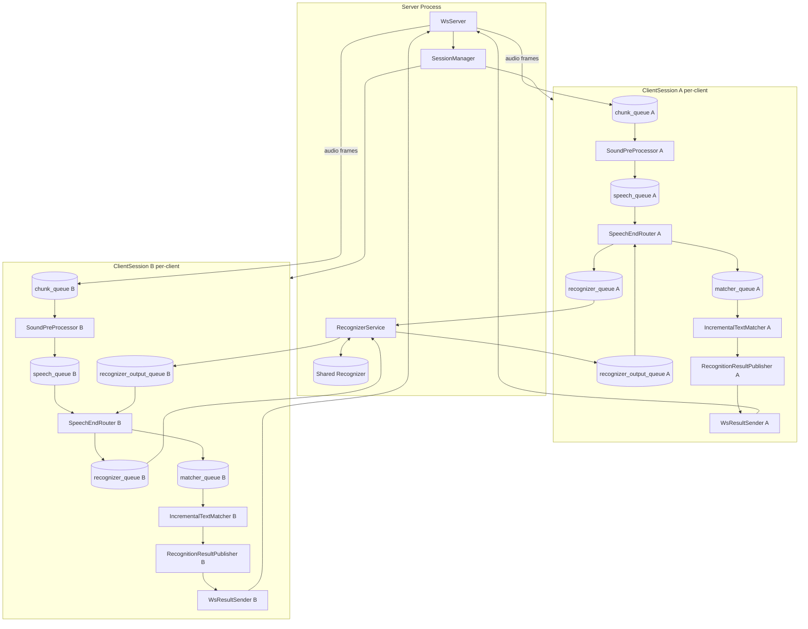

# Plan: Milestone 6.1 — Client-Server Architecture for Voice Agents

## Context

The monolithic STT app runs everything in one process. The goal is to split it into a **server process** (VAD + ASR + text matching + websocket server) and a **client process** (mic capture + GUI + text insertion + voice agent), communicating over WebSocket. From a user perspective the app still launches as one command (`python main.py`) — the server runs in-process and spawns the Tk client as a separate subprocess. A headless `--server-only` mode is supported for MSIX/macOS launcher integration.

The existing threaded pipeline (SoundPreProcessor, Recognizer, IncrementalTextMatcher, etc.) stays **completely unchanged**. All changes are at the boundaries.

---

## Architecture

### Process Model

```
python main.py
  ├── Server runs in THIS process (no GUI)
  │     WsServer (asyncio loop on daemon thread)
  │     RecognizerService (single shared Recognizer thread)
  │     SessionManager (creates ClientSession per WS connection)
  │
  └── Spawns internal Tk client subprocess
        AudioSource → WsClientTransport → RemoteRecognitionPublisher
        → TextFormatter, TextInsertionService, VoiceCommandAgent
        → ApplicationWindow (tkinter mainloop)
```

`main.py --server-only` runs server without spawning the client subprocess (headless).

### Transport

The API specification is in @docs/client-server-api-spec.md

### Async/Sync Boundary Strategy

The existing pipeline is 100% threaded. `websockets` is asyncio-based. One dedicated asyncio event loop thread per server. Two bridge directions:

- **Async → Sync** (WS receive → chunk_queue): `WsAudioReceiver` async coroutine calls `queue.Queue.put_nowait()` directly — safe because `queue.Queue` is thread-safe.
- **Sync → Async** (publisher callback → WS send): `WsResultSender` uses a bounded `asyncio.Queue` (capacity = 20) as an internal send buffer. A single async sender task drains it. The sync `on_partial_update`/`on_finalization` callbacks call `loop.call_soon_threadsafe(queue.put_nowait, encoded)`. If the queue is full, the item is dropped and logged (backpressure). This prevents unbounded task accumulation under fast partial updates.

No `asyncio.Queue` crosses thread boundaries.

---

## New Module Structure

```
src/
  network/
    types.py          # WsAudioFrame, WsShutdownCommand, WsRecognitionResult, WsSessionCreated, WsSessionClosed, WsError
    codec.py          # encode_audio_frame(), decode_audio_frame(), encode_server_message(), decode_client_message()
  server/
    ServerApp.py      # Orchestrates WsServer + RecognizerService; entry point for server mode
    WsServer.py       # websockets.serve() loop, dispatches to SessionManager
    SessionManager.py # Creates/destroys ClientSession instances
    ClientSession.py  # Per-session: queues, WsAudioReceiver, VoiceActivityDetector, GrowingWindowAssembler,
                      #   SoundPreProcessor, SpeechEndRouter (first_message_id=session_index*10_000_000),
                      #   IncrementalTextMatcher, WsResultSender
                      #   Must call app_state.set_state('running') after start() to mirror existing lifecycle semantics
    RecognizerService.py  # Shared single Recognizer thread; routes outputs by message_id // 10_000_000
    WsAudioReceiver.py    # Async coroutine: WS binary recv → chunk_queue bridge
    WsResultSender.py     # TextRecognitionSubscriber: bounded send queue + single async sender task
  client/
    tk/
      WsClientTransport.py      # asyncio loop on daemon thread; sends audio, receives results
      RemoteRecognitionPublisher.py  # Decodes WS JSON → calls RecognitionResultPublisher
      VoiceCommandAgent.py      # TextRecognitionSubscriber: detects commands in finalized text
      ClientApp.py              # Orchestrates AudioSource + WsClientTransport + Tk GUI
      GUI/
        ApplicationWindow.py
        ControlPanel.py
        HeaderPanel.py
        InsertionModePanel.py
        TextDisplayWidget.py
        TextFormatter.py
        TextInserter.py
        TextInsertionService.py
        KeyboardSimulator.py
        LoadingWindow.py
        ModelDownloadDialog.py
```

**Changed GUI component:**
- `src/client/tk/GUI/ApplicationWindow.py` — `PauseController` creation moved out; constructor accepts a `pause_controller` parameter (injected from `src/client/tk/ClientApp.py`). Tk `ClientApp` passes a plain `PauseController(app_state)`. `ControlPanel` typing unchanged (same `pause()`/`resume()`/`toggle()` interface contract).
- `src/gui/` is migrated to `src/client/tk/GUI/` and treated as client-owned UI code.

`main.py` — extended (not replaced):
- Default (no flags): start `ServerApp`, spawn internal Tk client subprocess
- `--server-only`: start `ServerApp` headless. Model check/download is CLI-driven (print missing model names + exit with non-zero if absent; no GUI dialogs)
- No public `--client` mode in this application. Future standalone clients connect via WebSocket as separate applications.

**Add to requirements.txt:** `websockets>=12.0`

---

## Components Changed

| Component | Change |
|---|---|
| `src/client/tk/GUI/*` | Move all Tk GUI modules from `src/gui/*` to `src/client/tk/GUI/*`; update imports accordingly |
| `src/client/tk/GUI/ApplicationWindow.py` | Accept injected `pause_controller` parameter instead of hardcoding `PauseController(app_state)` |
| `src/SpeechEndRouter.py` | Add `first_message_id: int = 1` parameter; line 58 becomes `self._next_message_id = first_message_id`. Default unchanged — all existing tests pass without modification. |
| `main.py` | Add mode detection; headless model check path for `--server-only` |

## Unchanged Components

| Component | Why unchanged |
|---|---|
| `src/sound/SoundPreProcessor.py` | chunk_queue interface identical |
| `src/sound/GrowingWindowAssembler.py` | called synchronously by SoundPreProcessor |
| `src/asr/Recognizer.py` | reads/writes queues unchanged |
| `src/postprocessing/IncrementalTextMatcher.py` | publishes via RecognitionResultPublisher unchanged |
| `src/RecognitionResultPublisher.py` | WsResultSender subscribes same as TextFormatter |
| `src/ApplicationState.py` | used per-session on server, per-process on client |
| `src/protocols.py` | TextRecognitionSubscriber protocol unchanged |
| `src/types.py` | codec serializes these directly |
| `src/controllers/PauseController.py` | used directly by ClientApp; no remote wrapping needed |
| `src/client/tk/GUI/ControlPanel.py` | calls `pause_controller.toggle()` — interface same |

## Session Ownership and Object Relationships

### Goals

- Preserve per-client isolation for all stateful pipeline components.
- Share only the expensive ASR model execution (`Recognizer`) across sessions.
- Prevent cross-session leakage of incremental text state and message routing.

### Ownership Model

| Scope | Components | Notes |
|---|---|---|
| Server-global (shared) | `ServerApp`, `WsServer`, `SessionManager` (owns session_index counter), `RecognizerService`, single `Recognizer` thread | Exists once per server process |
| Per-session (per WS client) | `ClientSession`, `ApplicationState`, `chunk_queue`, `speech_queue`, `recognizer_queue`, `recognizer_output_queue`, `matcher_queue`, `VoiceActivityDetector`, `GrowingWindowAssembler`, `SoundPreProcessor`, `SpeechEndRouter`, `IncrementalTextMatcher`, `RecognitionResultPublisher`, `WsResultSender` | Created on connect, destroyed on disconnect |

Note: `WsAudioReceiver` is an async coroutine that runs inside the WS connection handler for the duration of the session — it is logically per-session but is not a long-lived object instance.

### Critical Invariant

**`IncrementalTextMatcher` is never shared between clients.**

Reason: it holds mutable incremental state (`previous_result`, `_prev_normalized_words`, `prev_finalized_words`), so sharing would mix utterance history across clients and corrupt finalization.

### Session Data Flow

1. `WsAudioReceiver` decodes client audio → session `chunk_queue`
2. `SoundPreProcessor` reads `chunk_queue`, runs VAD/buffering → session `speech_queue`
3. `SpeechEndRouter` reads `speech_queue`, assembles segments → session `recognizer_queue`
4. `RecognizerService` multiplexes all sessions' `recognizer_queue`s → shared `Recognizer` input queue (with ID translation)
5. `RecognizerService` demultiplexes outputs → correct session `recognizer_output_queue` (with ID restoration)
6. Session `SpeechEndRouter` reads `recognizer_output_queue` → session `matcher_queue`
7. Session `IncrementalTextMatcher` reads `matcher_queue`, publishes via session `RecognitionResultPublisher`
8. Session `WsResultSender` subscribes to session publisher → sends results only to that client's websocket

### Lifecycle Rules

**On session create:**
- Allocate all per-session queues/components
- Wire per-session `RecognitionResultPublisher` to per-session `WsResultSender`
- Register session with `RecognizerService`
- Start session components, then set session `ApplicationState` to `running`

**On session destroy:**
- Set session `ApplicationState` to `shutdown` (stops per-session workers; does not affect shared `Recognizer`)
- Stop per-session workers
- Unregister session from `RecognizerService`: remove the session's global-ID routing entries from the routing table
- Drop all `ClientSession` references from `SessionManager` so matcher/publisher state is garbage-collected

**Server shutdown:**
- Stop accepting new WS connections
- Destroy all active sessions (per above)
- Shutdown shared `RecognizerService` and shared `Recognizer` via server-level `ApplicationState`

### Object Relationship Diagram



---

## Runtime Scope

- Supported runtime modes:
  - `python main.py` (server + internal Tk client subprocess)
  - `python main.py --server-only` (headless server)
- Not supported after Milestone 6.1:
  - monolithic in-process runtime mode

---

## Key Design Decisions

### Session-prefixed message_id allocation (fixes collision across sessions)

`SpeechEndRouter._next_message_id` starts at 1 per instance ([SpeechEndRouter.py:58](src/SpeechEndRouter.py#L58), [SpeechEndRouter.py:121](src/SpeechEndRouter.py#L121)), so per-session IDs collide when multiple sessions share a single `Recognizer`.

Fix: **session-prefixed IDs via `first_message_id` parameter on `SpeechEndRouter`**. Each session gets a non-overlapping ID range; `RecognizerService` routes outputs by pure arithmetic — no routing table, no translation.

Changes:
- `SpeechEndRouter.__init__` gains `first_message_id: int = 1`; line 58 becomes `self._next_message_id: int = first_message_id`. All existing tests pass unchanged (default is still 1).
- `SessionManager` maintains an atomic `session_index` counter (1-based, `threading.Lock` + int).
- `ClientSession` receives its `session_index` at construction and passes `session_index * 10_000_000` as `first_message_id` to `SpeechEndRouter`.
- Session 1 → IDs 10 000 001, 10 000 002, … | Session 2 → IDs 20 000 001, 20 000 002, …
- `RecognizerService` reads outputs from the shared `Recognizer` output queue; routes each item to the correct session's `recognizer_output_queue` via `item.message_id // 10_000_000` → session index → output queue reference (looked up from a simple `dict[int, queue.Queue]` keyed by session index, not by message_id).

Capacity: 10M IDs per session. At one segment per 200 ms minimum, that is ~57 hours of continuous speech before rollover — effectively unlimited.

### Shared Recognizer lifecycle: server-level ApplicationState

`Recognizer.on_state_change` stops the recognizer on `shutdown` ([Recognizer.py:78](src/asr/Recognizer.py#L78)). It ignores `running → paused` — no pause behavior.

`RecognizerService` passes a **server-level `ApplicationState`** (separate from all per-session states) to `Recognizer`. This means:
- Session shutdown (`session.app_state.set_state('shutdown')`) stops only the session's `SoundPreProcessor`, `SpeechEndRouter`, and `IncrementalTextMatcher` — never the shared `Recognizer`.
- The shared `Recognizer` stops only when `ServerApp.stop()` sets the server-level state to `shutdown`.

Per-session `ApplicationState` instances are never passed to `Recognizer`. `RecognizerService` does not register to session states.

### Bounded outbound send queue (fixes unbounded task accumulation)

`loop.call_soon_threadsafe(asyncio.ensure_future, ...)` per callback can flood the event loop under fast partial updates. Instead, `WsResultSender` holds a bounded `asyncio.Queue(maxsize=20)`. A single long-lived async task drains it with `await websocket.send(item)`. The sync callback calls `loop.call_soon_threadsafe(send_queue.put_nowait, encoded)` — if full, drops and logs. This gives natural backpressure.

### ApplicationWindow pause_controller injection (fixes hardcoded PauseController)

[ApplicationWindow.py:63](src/client/tk/GUI/ApplicationWindow.py#L63) hardcodes `PauseController(app_state)`. Fix: add `pause_controller: SupportsPauseControl | None = None` parameter, where `SupportsPauseControl` is a structural protocol with `pause()`, `resume()`, and `toggle()`. When `None`, `ApplicationWindow` constructs `PauseController(app_state)` as a safe default for tests and local construction.

`src/client/tk/ClientApp.py` passes a plain `PauseController(app_state)`. `ControlPanel` is typed against the `SupportsPauseControl` protocol, not a concrete class.

### ClientSession lifecycle: explicit `running` state

`pipeline.py:252` calls `app_state.set_state('running')` after all components start. `ClientSession.start()` must replicate this or lifecycle semantics break (components observe state transitions but never see `running` if state stays `starting`).

### Pause is client-only; server drains naturally

`paused` state lives exclusively in the client's `ApplicationState`. When the user pauses:
- Client `AudioSource` stops (observes `running → paused`)
- Client stops sending audio frames over WS
- Server-side `SoundPreProcessor` receives no new chunks and goes idle naturally

No `pause`/`resume` control commands are sent over the WS protocol. The server never needs to know the client is paused.

### Headless model provisioning for `--server-only`

`main.py` currently shows GUI dialogs for model download. For `--server-only`: if models are missing, print their names to stderr and exit with code 1. No interactive prompts. This is a precondition for server start (models must be provisioned externally for headless/MSIX deployment).

### Per-session VoiceActivityDetector (fixes stateful model sharing)

`VoiceActivityDetector` wraps the Silero VAD ONNX model and holds `self.model_state` — a `(2, 1, 128)` numpy array representing the RNN hidden state. This state is read and written on every call to `process_frame()` with no locking. Sharing one instance across sessions would corrupt speech detection for all clients.

Fix: **each `ClientSession` creates its own `VoiceActivityDetector` instance**, loaded from the same `silero_vad.onnx` file on disk. The file is ~2 MB and `onnxruntime.InferenceSession` creation completes in under 100 ms — cost is acceptable on connect.

`GrowingWindowAssembler` is similarly per-session: it accumulates `self.segments` across frames and resets only after utterance finalization. It is owned by `SoundPreProcessor` per-session as before.

Neither `VoiceActivityDetector` nor `GrowingWindowAssembler` require any code changes — they are simply instantiated inside `ClientSession.__init__` alongside `SoundPreProcessor`, with the `vad_model_path` passed down from `ServerApp`.

### Voice agent confidence gate and cooldown

`VoiceCommandAgent` acts only on `on_finalization()`, requires `confidence >= 0.55`, enforces 1.5s cooldown per command. Command text is not inserted into external apps.

---

## TDD Implementation Phases

### Phase 1: Network types and codec
- `src/network/types.py`, `src/network/codec.py`
- `tests/test_ws_codec.py`: roundtrip encode/decode binary frame, header length prefix integrity, invalid header rejection, num_samples mismatch detection, JSON encode/decode for all server message types, shutdown command decode, unknown type handling

### Phase 2: WsResultSender (bounded sync-to-async bridge, server)
- `src/server/WsResultSender.py`
- `tests/test_ws_result_sender.py`: partial/final enqueues message on bounded queue, single sender task drains queue and calls websocket.send, full queue drops item without blocking sync caller, correct status field in payload, closed connection does not raise to caller, session_id in all messages
- Test strategy: real `asyncio` event loop, replace websocket with `asyncio.Queue` as send sink, call `on_partial_update`/`on_finalization` from `threading.Thread`

### Phase 3: WsAudioReceiver (async-to-sync bridge, server)
- `src/server/WsAudioReceiver.py`
- `tests/test_ws_audio_receiver.py`: binary frame puts correct chunk dict to queue, chunk dict matches AudioSource format (`{audio, timestamp, chunk_id}`), decode error sends WsError and continues, shutdown command text frame triggers session shutdown, full chunk queue drops without blocking, ConnectionClosed exits cleanly
- Test strategy: `AsyncMock` for websocket, `asyncio.run()` to drive coroutine

### Phase 4: RecognizerService and ClientSession (server pipeline wiring)
- `src/server/RecognizerService.py`, `src/server/ClientSession.py`
- `tests/test_recognizer_service.py`:
  - session 1 (index=1) IDs start at 10_000_001; session 2 (index=2) IDs start at 20_000_001 — no collision
  - output with message_id=10_000_001 routed to session 1 output queue, not session 2
  - output with message_id=20_000_001 routed to session 2 output queue, not session 1
  - session removal unregisters its index; subsequent outputs with that prefix are dropped/logged
  - RecognizerService uses server-level ApplicationState (session shutdown does not stop Recognizer)
- `tests/test_client_session.py`: start() transitions app_state to running, stop() triggers shutdown state, audio chunk in chunk_queue reaches SoundPreProcessor
- Test strategy: mock `Recognizer` model, real queues, `threading.Event` for coordination

### Phase 5: ApplicationWindow pause_controller injection
- Move `src/gui/*` to `src/client/tk/GUI/*` and update all imports (`src`, `tests`, and entrypoints) to new paths
- Modify `src/client/tk/GUI/ApplicationWindow.py`: add `pause_controller` parameter (type: `SupportsPauseControl | None = None`; constructs default `PauseController` when `None`)
- `tests/gui/test_application_window.py` (or relocated `tests/client/tk/GUI/test_application_window.py`): constructor with injected controller passes it to ControlPanel; constructor without argument still creates PauseController internally

### Phase 6: WsClientTransport and RemoteRecognitionPublisher (client)
- `src/client/tk/WsClientTransport.py`, `src/client/tk/RemoteRecognitionPublisher.py`
- `tests/test_ws_client_transport.py`: audio chunk encoded as binary frame and sent, received JSON text frame dispatched to remote publisher, disconnect stops event loop thread cleanly
- `tests/test_remote_recognition_publisher.py`: partial result calls `on_partial_update` on subscribers, final result calls `on_finalization`, subscriber exception does not crash transport

### Phase 7: VoiceCommandAgent (client)
- `src/client/tk/VoiceCommandAgent.py`
- `tests/test_voice_command_agent.py`: each command invokes correct local action, low confidence ignored, cooldown prevents duplicate commands within 1.5s, partial updates never trigger, case-insensitive matching, command text not forwarded to insertion service

### Phase 8: SessionManager and WsServer (server entry)
- `src/server/SessionManager.py`, `src/server/WsServer.py`
- `tests/test_session_manager.py`: create_session returns unique session_id and sends session_created, destroy_session stops all session components, two sessions run independently

### Phase 9: ServerApp and Tk ClientApp (orchestration)
- `src/server/ServerApp.py`, `src/client/tk/ClientApp.py`
- `tests/test_server_app.py`: server starts WsServer on available port, accepts connection, emits session_created
- `tests/test_client_app.py`: client connects to server, receives session_created, AudioSource wired to transport

### Phase 10: main.py modes and E2E
- Extend `main.py`: default mode (server + spawn internal Tk client subprocess), `--server-only` (headless, CLI model check)
- `tests/test_e2e_client_server.py`:
  - Single client: feed `tests/fixtures/en.wav` via FileAudioSource variant, assert non-empty finalization received at mock subscriber
  - Dual client: two sessions run concurrently, inference results do not cross-contaminate, global message_ids are unique
  - Shutdown: graceful drain semantics, no thread leaks

---

## Critical Files to Reference During Implementation

| File | Why |
|---|---|
| [src/types.py](src/types.py) | AudioSegment, RecognitionResult — codec must produce/consume exactly |
| [src/RecognitionResultPublisher.py](src/RecognitionResultPublisher.py) | WsResultSender and RemoteRecognitionPublisher subscribe to this |
| [src/sound/SoundPreProcessor.py](src/sound/SoundPreProcessor.py) | chunk_queue item format `{audio, timestamp, chunk_id}` that WsAudioReceiver must produce |
| [src/asr/VoiceActivityDetector.py](src/asr/VoiceActivityDetector.py) | Stateful ONNX model (`model_state` RNN hidden state) — must be per-session; `ClientSession` instantiates one per connection |
| [src/SpeechEndRouter.py](src/SpeechEndRouter.py) | Gets `first_message_id` parameter (line 58); `ClientSession` passes `session_index * 10_000_000` |
| [src/ApplicationState.py](src/ApplicationState.py) | Client-side lifecycle state; `paused` state stops `AudioSource` |
| [src/client/tk/GUI/ApplicationWindow.py](src/client/tk/GUI/ApplicationWindow.py) | PauseController hardcoded at line 63 — must be injected |

---

## Verification

1. `python -m pytest tests/` — all existing tests pass (no regressions)
2. `python -m pytest tests/test_ws_codec.py tests/test_ws_result_sender.py tests/test_ws_audio_receiver.py tests/test_recognizer_service.py tests/test_client_session.py tests/test_ws_client_transport.py tests/test_remote_recognition_publisher.py tests/test_voice_command_agent.py tests/test_session_manager.py` — all new unit tests pass
3. `python -m pytest tests/test_e2e_client_server.py` — E2E with fixture audio produces recognized text, dual-client isolation confirmed
4. `python main.py` — server starts, spawns internal Tk client subprocess, mic audio recognized and displayed, pause button stops mic locally
5. `python main.py --server-only` — starts headless; prints error and exits if models missing; accepts external standalone WebSocket client connections
6. Voice commands: say "pause listening" → mic stops (client-side only); say "resume listening" → mic restarts
