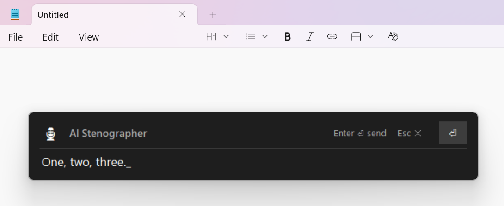

# AI Stenographer

**AI Stenographer** is a free, offline, real-time speech recognition desktop application designed for work and personal use. It converts spoken words into text in real time, without an internet connection and without sending any data anywhere.

The Stenographer is good to create logs of meetings and conversations.

It can work in the background on a modern notebook, consuming 0.5% of CPU, just in case you want to recall what you talked about.

It allows entering text with voice to any other application.

## Features

- 20 European languages
- Real-time speech-to-text conversion
- Fully offline operation
- Uses GPU to run, either embedded with CPU or a discrete video card
- Based on open-source libraries
- Allows entering text with voice to other applications

## Installation

1. Download the distributive package: [Version 1.6](https://github.com/grikdotnet/ai-stenographer/releases/download/1.6/AI-Stenographer-1.6.zip).
2. Extract the downloaded ZIP package.
3. Run the `STT - Stenographer` icon.

## Usage

- Launch the application.
- Select your audio input device (microphone).
- Press **Start** to begin transcription.
- Press **Stop** to end transcription.
- Copy or save the text as needed.

## Requirements

- Windows 10 or 11
- Microphone
- It Downloads a 1.2GB speech recognition model
- Consumes 1.2 GB of RAM

## License

**AI Stenographer** is provided as-is. Use at your own risk. Commercial use is permitted.  

Open-source components used in this project are listed in the `LICENSES` folder. Each component retains its original license.
